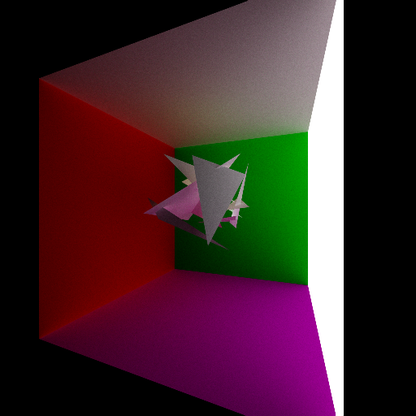
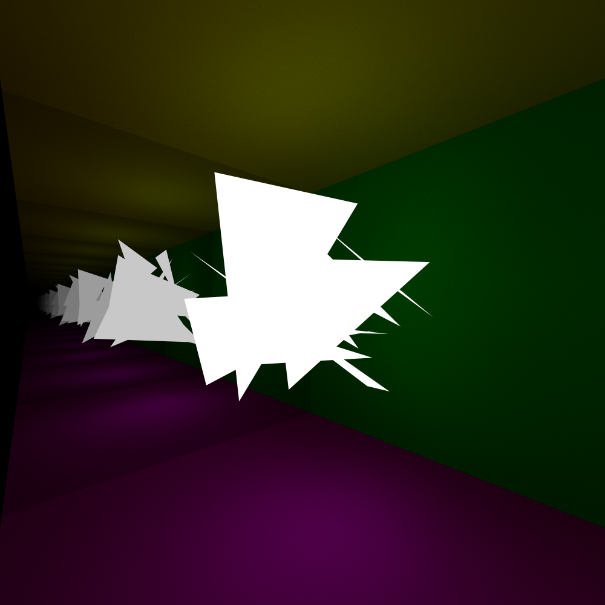
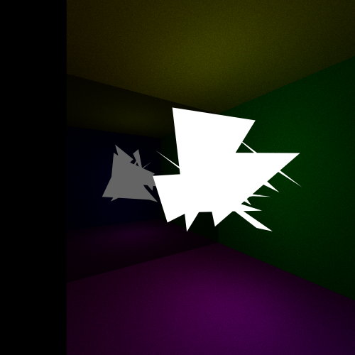

# 3D_Pathtracer
This project is a 3D pathtracer built in pure C which renders an image in the `.ppm` format. 

## Key Features
- **Pure C implementation** - No external libraries
- **Physically-based rendering** - Accurate light transport simulation
- **Multi-bounce global illumination** - Realistic lighting with reflections
- **Command-line progress tracking** - Real-time render statistics

## Technical Implementation
- **Ray-triangle intersection** using Möller-Trumbore algorithm
- **Monte Carlo sampling** for anti-aliasing and global illumination
- **Cosine-weighted hemisphere sampling** for realistic diffuse reflections
- **Perfect specular reflection** for mirror surfaces
- **PPM image output** for simple, uncompressed results

## Future Optimizations
The pathtracer is incredibly slow, lacking many basic optimisations. However, the following optimisations are in the roadmap for implementation:
- **Adaptive pixel sampling**: Instead of always casting all 1000+ rays per pixel, first cast 9 strategic rays (corners, edges, center). If they all miss, skip the remaining rays. If they all hit the same triangle, only test that triangle for the remaining rays.
 - **Bounding Volume Hierarchy Tree**. We can arrange the triangles into a binary tree with each node being a Axis Aligned Bounding Box. This means we can cut out triangle search space in half at each step, resulting in $O(log(n))$ instead of $O(n)$
 - **SIMD Instructions** to make 4 ray triangle intersection checks in parallel

## Examples


#### Performance
**Render Time:** 18322.201s (5h 5m 22.201s)
#### Specs  
**CPU:** i9-12900k  
**Threads:** 1  
**Compiler:** gcc  
**Compiler Flags:** -Wall -g -mavx -O3 (although mavx is not used)  
#### Render Params
**Dimensions:** 1024x1024  
**Rays Per Pixel:** 2048  
**Max Bounces Per Ray:** 20  
**Horizontal FOV:** 90  
**Triangles:** 30



#### Performance
**Render Time:** 1184.264s (19m 44.264s)
#### Specs  
**CPU:** i9-12900k  
**Threads:** 1  
**Compiler:** gcc  
**Compiler Flags:** -Wall -g -mavx -O3 (although mavx is not used)  
#### Render Params
**Dimensions:** 512x512  
**Rays Per Pixel:** 2048  
**Max Bounces Per Ray:** 4  
**Horizontal FOV:** 90  
**Triangles:** 20


#### Performance
**Render Time:** 10603.7s (2h 56m 43s)  
#### Specs  
**CPU:** i9-12900k  
**Threads:** 1  
**Compiler:** gcc  
**Compiler Flags:** -Wall -g -mavx -O3 (although mavx is not used)  
#### Render Params
**Dimensions:** 1000x1000  
**Rays Per Pixel:** 4096  
**Max Bounces Per Ray:** 20  
**Horizontal FOV:** 90  
**Triangles:** 30

  
#### Performance
**Render Time:** 560s (9m 20s)  
#### Specs  
**CPU:** i9-12900k  
**Threads:** 1  
**Compiler:** gcc  
**Compiler Flags:** -Wall -g -mavx -O3 (although mavx is not used)  
#### Render Params
**Dimensions:** 500x500  
**Rays Per Pixel:** 1024  
**Max Bounces Per Ray:** 20  
**Horizontal FOV:** 90  
**Triangles:** 30

  

#### Performance
**Render Time:** 628.4s (10m 28s)  
#### Specs  
**CPU:** i9-12900k  
**Threads:** 1  
**Compiler:** gcc  
**Compiler Flags:** -Wall -g -mavx -O3 (although mavx is not used)  
#### Render Params
**Dimensions:** 500x500  
**Rays Per Pixel:** 1024  
**Max Bounces Per Ray:** 50  
**Horizontal FOV:** 90  
**Triangles:** 30

## Performance
### Unoptimized
#### Performance Explanation
You might be wondering whats taking an i9-12900k almost 15 minutes to render only 30 triangles at 500x500 resolution?  
Well, there are $500\times500 = 250,000$ pixels  
each pixel casting $1024$ rays  
each ray bouncing a max of $50$ times  
each ray checking $30$ triangles (this highlights the need for a BVHT)  
```math
\text{Worst case (every ray bouncing 50 times): }500\times 500\times 1024\times 50\times 30 = 384,000,000,000
```
```math
\text{Average case (every ray bouncing 5 times, half triangles culled): }
500\times 500\times 1024\times 5\times 15 = 19,200,000,000
```
```math
\text{Reasonable Best case (every ray bouncing 1 times, half triangles culled): }
500\times 500\times 1024\times 15 = 3,840,000,000 
```
Even in the best case there is still almost 4 billion ray intersect checks to complete, or 4.5 million per second at 870.5s render time.

## Optimized Renderer
### Optimizations
#### Adaptive pixel sampling

#### Bounding Volume Hierarchy Tree


## Unoptimized Renderer
This is the first complete, unoptimized implimentaion. It uses a lot of brute force to render the image, resulting in long render times.