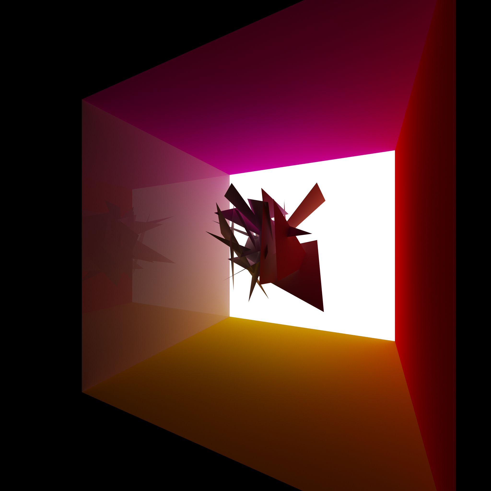

# 3D Pathtracer
## Overview
This project is a 3D pathtracer implemented in C++ with hardware acceleration using CUDA.

Originally implemented in single-threaded pure C, this new hardware-accelerated version achieves **~1,520.5x** speed improvement (more details in Performance Evolution section below).


*Physically accurate global illumination with complex material interactions. The left wall has 0.7 roughness, creating realistic mixed diffuse-specular reflections.*\
**Note**: Gamma correction disabled for artistic preference
- **Render Time**: 13.2 seconds  
- **Resolution**: 2048×2048 (4.2M pixels)
- **Samples**: 8,192 rays per pixel
- **Scene Complexity**: 10 triangles
- **Ray Intersections**: ~2.7 trillion operations
- **Hardware**: NVIDIA RTX 4090 (16,384 CUDA cores)
- **Throughput**: ~205 billion rays/second

## Quick Start
Step 1:\
Clone the repo onto your device
```bash
git clone https://github.com/yourusername/cuda-pathtracer.git
cd cuda-pathtracer
```
Step 2:\
Setup the build directory
```bash
mkdir build
cd build
cmake ..
```

Step 3:\
Build with either Debug or Release
```bash
cmake --build . --config Release
```
or
```bash
cmake --build . --config Debug
```

Step 4:\
Run the project (depends if you chose Debug or Release before)
```bash
Debug\d.exe
```
or
```bash
Release\d.exe
```

## Performance Evolution
- **V1**: Single Threaded CPU (~5 hours above)
- **V2**: CUDA parallel processing (~13 seconds)

**NOTE:** V1 did have multithreaded through #pragma omp parallel for, however it was harder to benchmark, so single threaded numbers are being used
### Improvement Over V1

In V1 of this project, the following image took `18322.2s` to render.

- **Resolution**: 1024x1024
- **Samples**: 8,192 rays per pixel  
- **Scene Complexity**: 30 triangles
- **Hardware**: Intel Core i9-12900k

Comparing to a render of V2, which took `48.2s` to render

- **Resolution**: 2048×2048 (4.2M pixels)
- **Samples**: 8,192 rays per pixel
- **Scene Complexity**: 30 triangles
- **Hardware**: NVIDIA RTX 4090 (16,384 CUDA cores)

**NOTE:** The images are not identical, however they are close enough in complexity to reasonably compare performance

The render from V2 was `4x` more complex than the render from V1 (`2048x2048 = (2*1024)x(2*1024) = 4*(1024x1024)`)

Performance Speedup: `(18322.2 * 4) / 48.2 =` **1520.5x Speedup**

#### Why not 16,384x speedup?
- **Texture sampling overhead** - V2 includes texture mapping
- **Launch overhead** - CUDA kernel launches have costs
- **Unoptimized code** - V2 is initial implementation without optimizations

## Optimisations
We will be Benchmarking with this image:

- **Resolution**: 2048×2048 (4.2M pixels)
- **Samples**: 8,192 rays per pixel
- **Scene Complexity**: 30 triangles
- **Hardware**: NVIDIA RTX 4090 (16,384 CUDA cores)

**Starting Render Time:** 45.6s

### Early Pixel Termination (1.065x speedup)
We can cast 9 strategic rays (corners, edges, middle) And if all them dont hit anything, we consider the pixel to be black and early return.

In code that looks like this:
```C++
__device__ bool isBlankPixel(const DeviceTriBuffer& deviceTriBuffer, const Camera& camera, unsigned int planeX, unsigned int planeY, unsigned int& seed) {
    float subPixelOffsetX, subPixelOffsetY;
    int missedRayCount = 0;

    for (int x=0; x < 3; x++) {
        for (int y=0; y < 3; y++) {
            subPixelOffsetX = x * .5;
            subPixelOffsetY = y * .5;
            Ray ray = Ray(planeX, planeY, subPixelOffsetX, subPixelOffsetY, camera, seed);

            missedRayCount += !ray.getTriIntersection(deviceTriBuffer).hit;
        }
    }

    return missedRayCount == 9;
}
```

Final time after optimisation: `42.8s`\
Thats a `45.6/42.8 =` **1.065x speedup**

### Change `TriHit` To Use Pointers (1.48x speedup)
This optimisation was descovered by accident while working on the below optimisation (Ray Coherence)

`TriHit` previously Looked like this
```C++
struct TriHit {
    Vec3 intersecPoint;
    float dist;
    Vec3 baryCoords;
    Tri tri;
    bool hit;
};
```
However, we can store a reference to `Tri` instead of copying the entire tri each time.
```C++
struct TriHit {
    Vec3 intersecPoint;
    float dist;
    Vec3 baryCoords;
    const Tri* tri;
    bool hit;
};
```

The reason this has such a dramatic performance boost is that TriHit is in the hottest loop in the entire program. It's returned for each ray-tri intersection check, which is the heart of the 3d pathtracer

Final time after optimisation: `28.9s`\
Thats a `42.8/28.9 =` **1.48x speedup**

### Pixel Triangle Coherence Checking (1.06x speedup)
Similar to Early Pixel Termination, we can cast 9 strategic rays and check if they all hit the same triangle. If they all do then we can skip the first ray-tri intersection check, and only intersect with the one triangle.

We can modify the Early Pixel Termination code to also check for this by returning a POD struct `pixelOptimisationReport`

```C++
struct pixelOptimisationReport {
    bool isBlankPixel;
    bool isCoherentPixel;
    Tri& coherentTri;
}
```
```C++
__device__ PixelOptimisationReport pixelOptimisationsCheck(const DeviceTriBuffer& deviceTriBuffer, const Camera& camera, unsigned int planeX, unsigned int planeY, unsigned int& seed) {
    float subPixelOffsetX, subPixelOffsetY;
    int missedRayCount = 0;

    const Tri* referenceTriPointer = nullptr;

    TriHit triHit;

    bool coherentTri = true;

    PixelOptimisationReport dummyReport = PixelOptimisationReport(false, false, Tri());

    for (int x=0; x < 3; x++) {
        for (int y=0; y < 3; y++) {
            subPixelOffsetX = x * .5;
            subPixelOffsetY = y * .5;
            Ray ray = Ray(planeX, planeY, subPixelOffsetX, subPixelOffsetY, camera, seed);

            triHit = ray.getTriIntersection(deviceTriBuffer, dummyReport, false);

            if (x==0 && y==0) {
                if (triHit.hit) {
                    referenceTriPointer = triHit.tri;
                } else {
                    coherentTri = false;
                }
            }

            if (coherentTri) {
                coherentTri = referenceTriPointer == triHit.tri;
            }

            missedRayCount += !triHit.hit;
        }
    }

    return PixelOptimisationReport(
        missedRayCount == 9,
        coherentTri,
        *referenceTriPointer
    );
}
```
The code now compares each intersected triangle with a reference triangle (reference triangle is the first triangle hit). If all triangles are equal to the reference triangle, then we know the pixel is coherent and we can assume we hit this triangle first for all camera ray casts.

We can now also modify the ray-tri intersection code to skip if we are a coherent tri and we are not a bouncing ray

```C++
    __device__ TriHit getTriIntersection(const DeviceTriBuffer& deviceTriBuffer, const PixelOptimisationReport& pixelOptimisationReport, bool cameraRay) const {
        if (cameraRay && pixelOptimisationReport.isCoherentPixel) {
            return rayTriIntercept(pixelOptimisationReport.coherentTri);
        }

        // Skip entire triangle intersection checking loop
    }
```

Final time after optimisation: `27.3s`\
Thats a `28.9/27.3 =` **1.12x speedup**

### Remove Error Checking In Release Build (1.12x speedup)
Since we can be reasonably confident that out of bound memory accesses wont take place in build, we can use a preprocessor conditional to not run the checks.

This is especially usefull in the `getTri` method, as this is run for every ray-tri intercept check
```C++
__device__ const Tri& getTri(unsigned int i) const {
    #ifdef DEBUG
    if (i >= numTris) {
        printf("[DEVICE ERROR] in getTri, index out of range");
    }
    #endif
    return tris[i];
}
```

Final time after optimisation: `24.3s`\
Thats a `27.3/24.3 =` **1.12x speedup**

### Rewrite `bsdfReflect` to use branchless programming
`bsdfReflect` was in desperate need of a rewrite anyway
