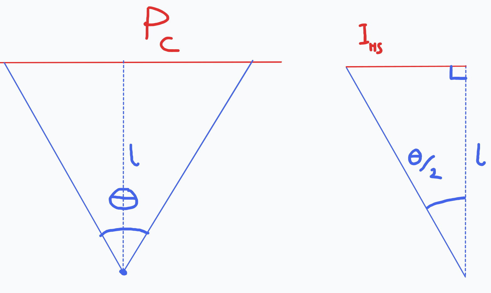

# 3d Raytracer
## Section 1 - Rayracing
### Making the rays
(I got the idea for this from a friend describing how he implimented his 3d renderer from a math writeup)

Let:  
$\overrightarrow{C_U} =$ Cameras normalised up vector in global space,  
$\overrightarrow{C_R} =$ Cameras normalised right vector in global space,  
$\overrightarrow{C_F} =$ Cameras normalised forward vector in global space,  
$\overrightarrow{C_P} =$ Cameras position in global space,  
$O =$ The global origin,
$l =$ Cameras focal length

Suppose a vector $\overrightarrow{P_O}$ which goes from $O$ to the point $l$ units from $\overrightarrow{C_P}$, this can be calculated as follows:
$$
\overrightarrow{P_O} = \overrightarrow{C_P} + \overrightarrow{C_F}\cdot l
$$

We can now construct a plane $P_C$ in terms of $\overrightarrow{C_U}$, $\overrightarrow{C_R}$ and $\overrightarrow{P_O}$ as follows:
$$
P_C(s,t) = s\cdot \overrightarrow{C_U} + t\cdot \overrightarrow{C_R} + \overrightarrow{P_O}
$$

Now that we have our focal plane, lets define some more variables. Let:  
$F_H, F_V =$ horizontal fov, vertical fov  
$P_H, P_V$ horizontal pixels, vertical pixels  
$\overrightarrow{OI_{00}}, \overrightarrow{OI_{10}}, \overrightarrow{OI_{01}}, \overrightarrow{OI_{11}} =$ the bottom left, bottom right, top left, top right corners of the view plane

The view plane is a rectangular subset of $P_C$ which represents what will be rendered to the screen. We will split it up into pixels to help us generate the rays.

We can directly calculate $\overrightarrow{OI_{00}}$ to $\overrightarrow{OI_{11}}$ with some simple trig.

Using the above right triange, we can calculate the half scalar we can feed into $P_C$ required to get us $\overrightarrow{OI_{00}}$ through to $\overrightarrow{OI_{11}}$. 
$$
\begin{align}
    \tan(\theta/2) &= \frac OA\\
    &= \frac{I_{HS}}{l}\\
    \therefore I_{HS}&=\tan(\theta/2)\cdot l
\end{align}
$$

Using this, we can calcualte each $\overrightarrow{OI_{00}}$ to $\overrightarrow{OI_{11}}$ specifically as follows: 
$$
\text{Let: }V_{HS} = \tan(F_V/2)\cdot l\\
\text{and }H_{HS} = \tan(F_H/2)\cdot l\\
$$
$$
\begin{align}
    \overrightarrow{OI_{00}} &= P_C(-V_{HS}, -H_{HS})\\
    \overrightarrow{OI_{10}} &= P_C(-V_{HS}, H_{HS})\\
    \overrightarrow{OI_{01}} &= P_C(V_{HS}, -H_{HS})\\
    \overrightarrow{OI_{11}} &= P_C(V_{HS}, H_{HS})\\
\end{align}
$$

now that we have the view plane, we can split it up into pixels.  
Let:  
$W_{VP},H_{VP} =$ width, height of view plane  
$W_{P},H_{P} =$ width, height of a pixel on the view plane  
$$
\begin{align}
    W_{VP}&=|\overrightarrow{I_{00}I_{10}}|\\
    H_{VP}&=|\overrightarrow{I_{01}I_{11}}|\\
    W_{P}&=\\
    H_{P}&=
\end{align}
$$

### Ray intersection with a triangle (Möller–Trumbore intersection)
In order to determine if and where a ray has hit our triangle, we can use the Möller–Trumbore ray intersection algorithm. [learn more](https://en.wikipedia.org/wiki/M%C3%B6ller%E2%80%93Trumbore_intersection_algorithm#External_links).

My implimentation (very closely following [wikipedias](https://en.wikipedia.org/wiki/M%C3%B6ller%E2%80%93Trumbore_intersection_algorithm#External_links) implimentation), shown below, takes in a ray and a triangle and returns 1 or 0 depending on if there was an intercept. It also takes in a pointer to a Vec3 and modifies it with the location of the intercept. We need to know where the intercept is for later when we do ray tracing.
```C
int ray_triangle_intercept(Vec3 ray, Vec3 ray_origin, Tri tri, Vec3* int_pos) {
    ray = vec_normalise(ray);

    Vec3 e1 = vec_sub(tri.b, tri.a);
    Vec3 e2 = vec_sub(tri.c, tri.a);
    Vec3 rxe2 = vec_cross(ray, e2);
    float det = vec_dot(e1, rxe2);

    if (det > -epsilon && det < epsilon) {
        return 0; // no intercept
    }

    float inv_det = 1.0/det;
    Vec3 s = vec_sub(ray_origin, tri.a);
    float u = inv_det * vec_dot(s, rxe2);

    if (u < 0.0 || u > 1.0) { // modified from the wiki to be stricter and more efficient saving a couple checks
        return 0; // no intercept
    }

    Vec3 sxe1 = vec_cross(s, e1);
    float v = inv_det * vec_dot(ray, sxe1);

    if (v < 0.0 || u + v > 1.0) {
        return 0; // no intercept
    }

    float t = inv_det * vec_dot(e2, sxe1);

    if (t > epsilon) {
        *int_pos = vec_add(ray_origin, vec_scale(ray, t));
        return 1; // intercept
    } else {
        return 0; // no intercept
    }
}
```


## The Graveyard
This consists of old stuff i took out of the writeup but dont want to delte
Plane $P_C$ can also be described parametrically as follows:
$$
\begin{align}
    P_{Cx}(s,t) &= s\cdot\overrightarrow{C_{Ux}} + t\cdot\overrightarrow{C_{Rx}} + \overrightarrow{P_{Ox}}\\
    P_{Cy}(s,t) &= s\cdot\overrightarrow{C_{Uy}} + t\cdot\overrightarrow{C_{Ry}} + \overrightarrow{P_{Oy}}\\
    P_{Cz}(s,t) &= s\cdot\overrightarrow{C_{Uz}} + t\cdot\overrightarrow{C_{Rz}} + \overrightarrow{P_{Oz}}
\end{align}
$$

using this, a point $P$ is in $P_C$  $\iff\exists s,t\in\R :$
$$
\begin{align}
    P_{x} &= s\cdot\overrightarrow{C_{Ux}} + t\cdot\overrightarrow{C_{Rx}} + \overrightarrow{P_{Ox}}\\
    P_{y} &= s\cdot\overrightarrow{C_{Uy}} + t\cdot\overrightarrow{C_{Ry}} + \overrightarrow{P_{Oy}}\\
    P_{z} &= s\cdot\overrightarrow{C_{Uz}} + t\cdot\overrightarrow{C_{Rz}} + \overrightarrow{P_{Oz}}
\end{align}
$$